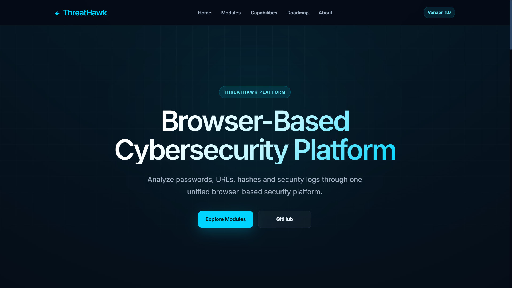
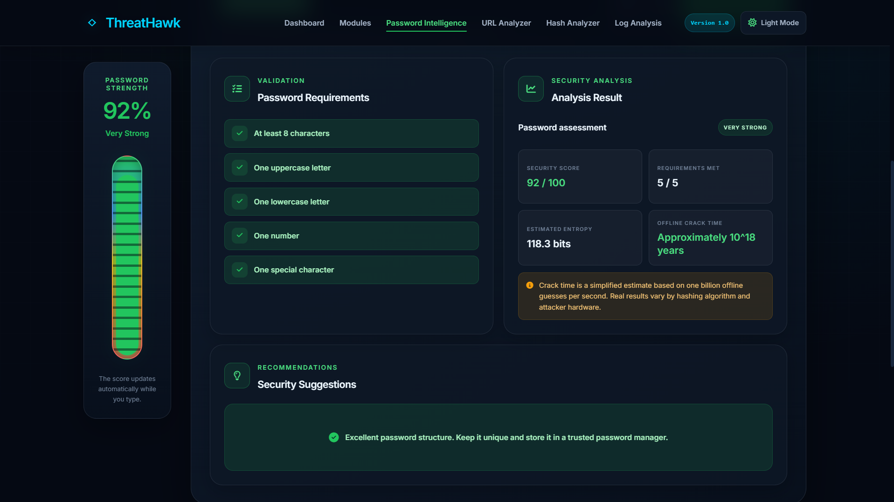
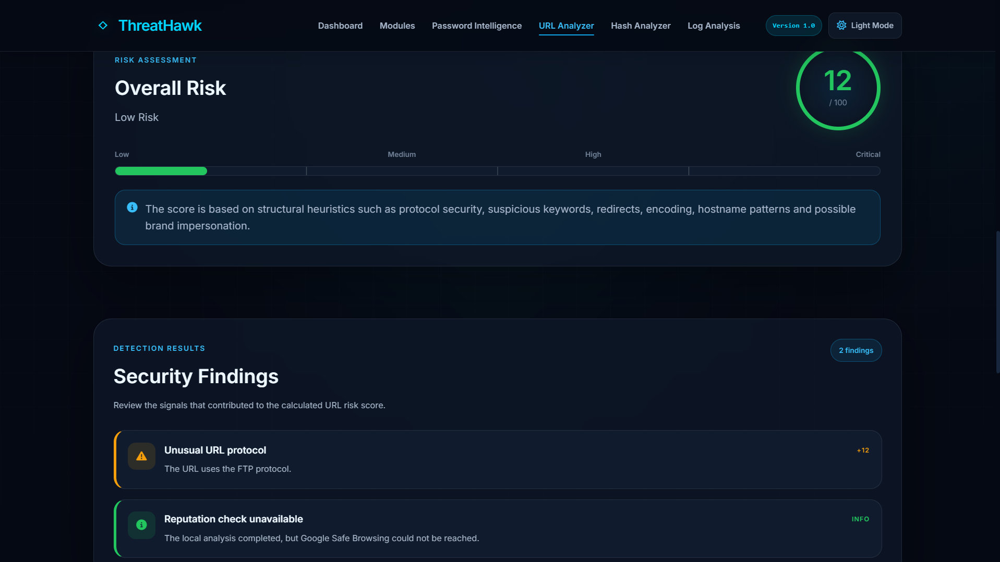
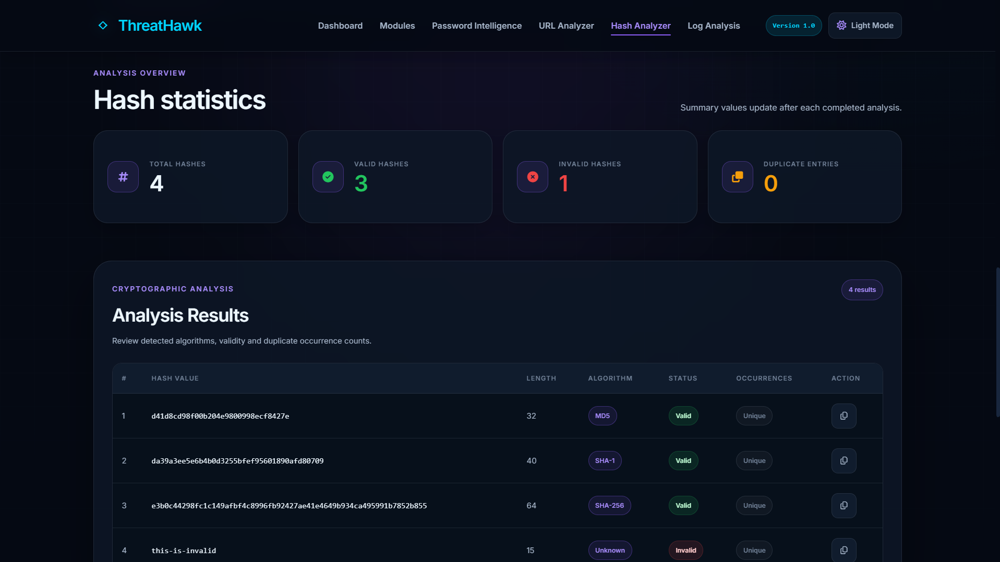
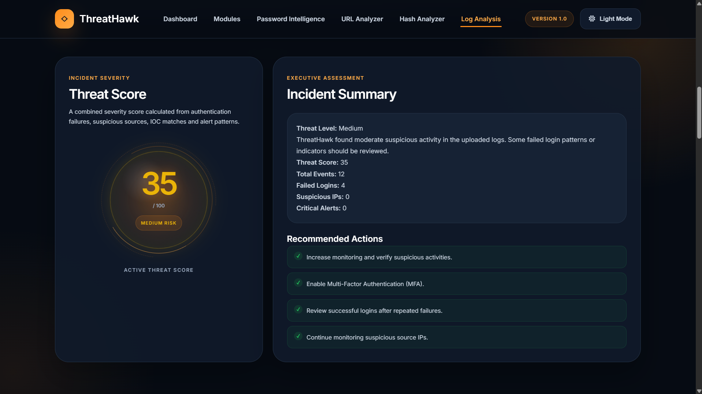
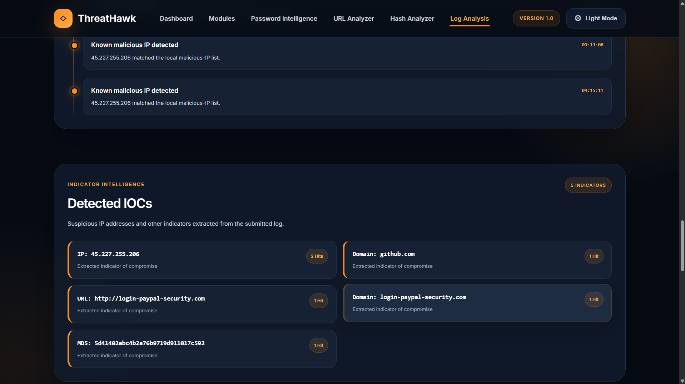

# 🛡️ ThreatHawk

> **An all-in-one browser-based cybersecurity platform for password analysis, URL inspection, hash identification, and security log investigation.**

ThreatHawk is a modern web application that combines essential cybersecurity utilities into a single, intuitive platform. Built entirely for the browser, it helps students, security enthusiasts, and professionals perform common security analysis tasks without installing multiple tools.

🌐 **Live Demo:** https://threathawk.net



---

## ✨ Why ThreatHawk?

Cybersecurity professionals often rely on multiple websites and utilities to perform routine analysis. ThreatHawk brings these essential capabilities together into one unified platform with a clean interface, fast performance, and practical features.

Whether you're evaluating password strength, investigating suspicious URLs, identifying cryptographic hashes, or analyzing security logs, ThreatHawk provides a streamlined experience from a single dashboard.

---

# 🚀 Platform Modules

## 🔐 Password Intelligence

Evaluate password strength using entropy analysis, crack-time estimation, and security best practices.

### Features

- Password strength scoring
- Entropy calculation
- Crack-time estimation
- Password requirement validation
- Actionable security recommendations
- Secure password generator



---

## 🌐 URL Analyzer

Inspect URLs for phishing indicators using structural analysis, heuristic checks, and brand impersonation detection.

### Features

- URL structure validation
- Suspicious keyword detection
- Brand impersonation analysis
- Risk assessment
- Security findings
- Safe Browsing integration support



---

## 🔑 Hash Analyzer

Automatically detect and validate common cryptographic hash formats while supporting multiple hashes in a single analysis.

### Features

- MD5 detection
- SHA-1 detection
- SHA-256 detection
- SHA-512 detection
- Multiple hash analysis
- Duplicate detection
- Export support



---

## 📄 SOC Log Analyzer

Analyze authentication and security logs to identify suspicious activity and generate meaningful security insights.

### Features

- Log parsing
- Threat scoring
- IOC extraction
- Incident summary
- Security recommendations
- Exportable reports

### Threat Analysis



### IOC Detection



---

# ⚡ Key Features

- Modern responsive interface
- Browser-based architecture
- No installation required
- Fast client-side analysis
- Multiple integrated cybersecurity tools
- Unified user experience
- Professional dashboard
- Export capabilities

---

# 🛠️ Technology Stack

### Frontend

- HTML5
- CSS3
- JavaScript

### Security Concepts

- Password Entropy
- URL Heuristics
- Brand Impersonation Detection
- Cryptographic Hash Identification
- Security Log Analysis
- IOC Extraction

### Development

- Git
- GitHub
- REST APIs

---

# 📂 Project Structure

```text
ThreatHawk/
│
├── css/
├── js/
├── assets/
├── images/
│   ├── dashboard.png
│   ├── password-analysis.png
│   ├── url-analysis.png
│   ├── hash-analysis.png
│   ├── log-analysis.png
│   └── log-ioc-analysis.png
│
├── index.html
└── README.md
```

---

# 🚀 Getting Started

Clone the repository

```bash
git clone https://github.com/DileepKumar52/ThreatHawk.git
```

Open the project folder

```bash
cd ThreatHawk
```

Launch the application by opening **index.html** in your preferred browser.

No additional dependencies or installation are required.

---

# 🎯 Roadmap

Future modules planned for ThreatHawk include:

- WHOIS Lookup
- DNS Lookup
- IP Reputation Checker
- SSL Certificate Inspector
- Email Header Analyzer
- Threat Intelligence Lookup
- Malware Hash Lookup
- VirusTotal Integration
- YARA Rule Playground

---

# 🤝 Contributing

Contributions, ideas, bug reports, and feature suggestions are always welcome.

If you discover a bug or have an idea that can improve ThreatHawk, feel free to open an issue or submit a pull request.

---

# 📄 License

This project is licensed under the MIT License.

---

# 👨‍💻 Author

**Dileep Kumar**

Cybersecurity Graduate • Software Developer

🌐 Website: https://threathawk.net

💼 LinkedIn: https://www.linkedin.com/in/dileep5231/
