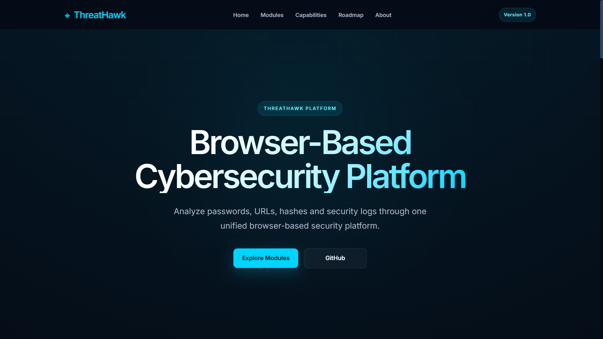
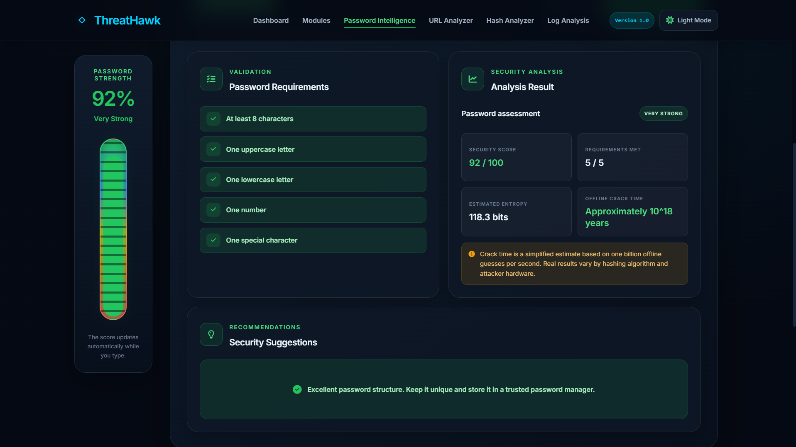
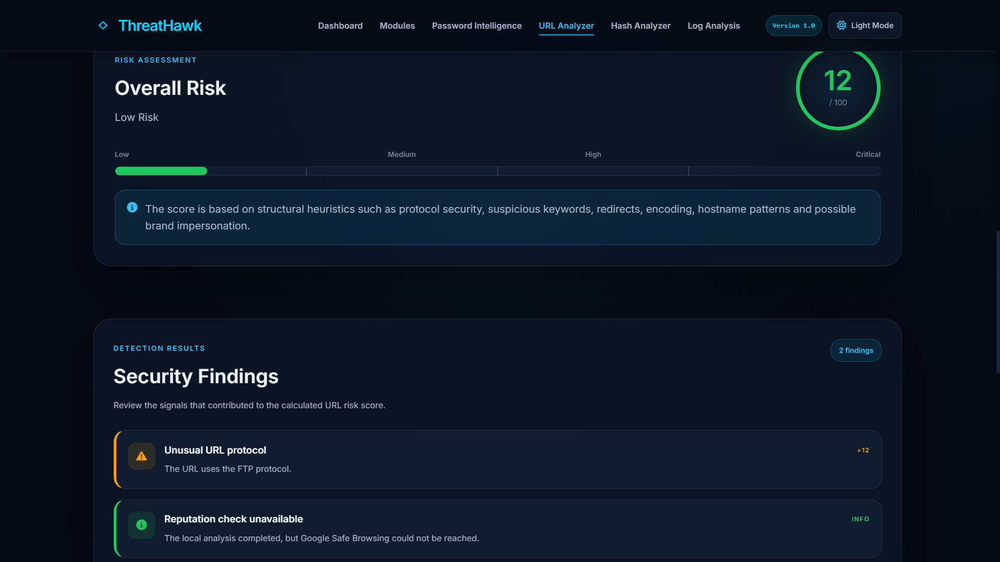
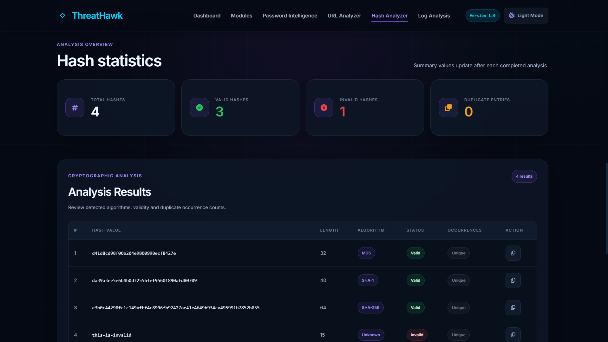
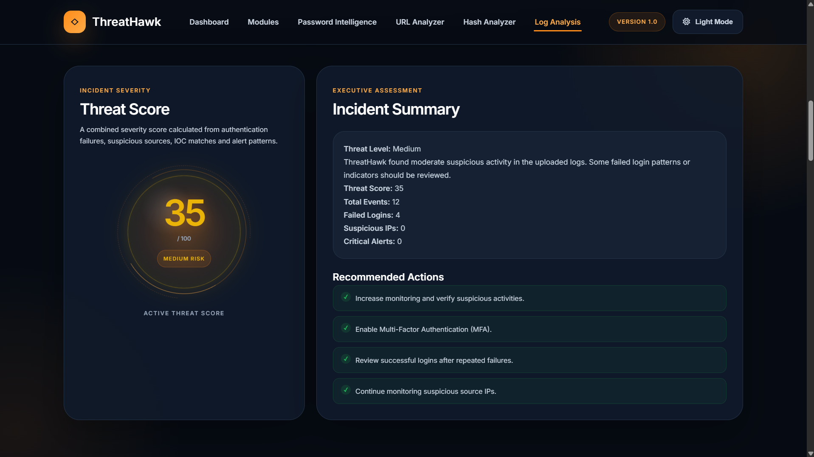
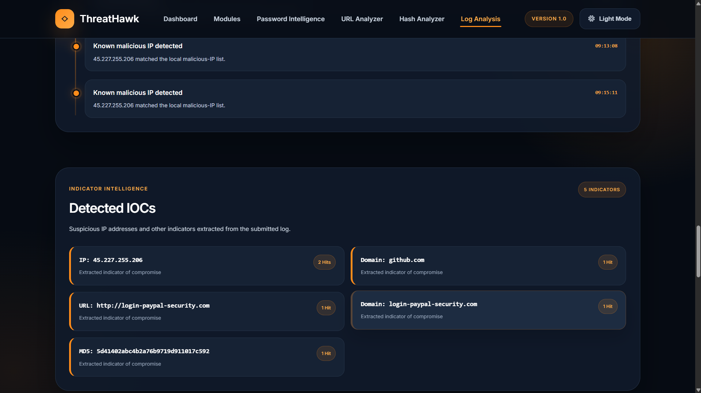
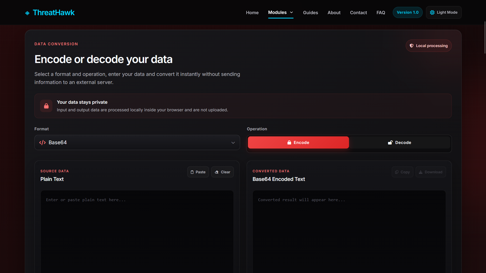

# 🛡️ ThreatHawk

> **A free browser-based cybersecurity platform combining practical security tools with educational cybersecurity guides.**

ThreatHawk is an open-source cybersecurity platform designed for students, security enthusiasts, SOC analysts, and cybersecurity professionals.

It combines practical browser-based security utilities with a dedicated **Cybersecurity Knowledge Hub**, allowing users to learn security concepts and apply them using related tools from the same platform.

🌐 **Live Platform:** https://threathawk.net



---

## ✨ About ThreatHawk

Cybersecurity analysis often requires switching between multiple websites, utilities, and reference materials.

ThreatHawk brings commonly used security analysis capabilities together into a single platform with a clean interface, practical workflows, and educational resources.

The platform currently provides tools for:

- Password security analysis
- Suspicious URL analysis
- Cryptographic hash identification
- Security log investigation
- IOC extraction
- Data encoding and decoding

Alongside the tools, the **ThreatHawk Knowledge Hub** explains the cybersecurity concepts behind them.

---

# 🚀 Platform Modules

## 🔐 Password Intelligence

Analyze password strength and understand the factors that influence password security.

### Features

- Password strength scoring
- Entropy analysis
- Crack-time estimation
- Password requirement validation
- Actionable security recommendations
- Secure password generator
- Local browser-based processing



---

## 🌐 URL Analyzer

Inspect suspicious URLs for structural anomalies, phishing indicators, and possible brand impersonation.

### Features

- URL structure validation
- Suspicious keyword detection
- Brand impersonation analysis
- Path and query analysis
- Risk assessment
- Security findings
- Google Safe Browsing integration



---

## 🔑 Hash Analyzer

Identify and validate common cryptographic hash formats individually or in batches.

### Supported Formats

- MD5
- SHA-1
- SHA-256
- SHA-512

### Features

- Automatic hash identification
- Multiple hash analysis
- File-based hash input
- Duplicate detection
- Occurrence counting
- Format validation
- TXT, JSON, CSV and PDF report exports
- Local browser-based processing



---

## 📄 Security Log Analyzer

Analyze security and authentication logs to identify suspicious activity and extract useful investigation data.

### Features

- CSV and JSON log analysis
- Severity classification
- Threat scoring
- IOC extraction
- IOC occurrence counting
- Live log search
- Severity filtering
- Incident summaries
- Security recommendations
- Exportable reports

### Threat Analysis



### IOC Detection



---

## 🔄 Encoder & Decoder

Encode and decode commonly encountered data formats directly inside the browser.

### Supported Formats

- Base64
- Base64 URL
- URL Encoding
- HTML Entities
- Hexadecimal
- Binary
- ROT13

### Features

- Encode and decode operations
- UTF-8 support
- Character and byte counters
- Copy and paste controls
- Input/output swapping
- Downloadable output
- Local browser-based processing



---

# 📚 Cybersecurity Knowledge Hub

ThreatHawk also includes a dedicated educational section connecting cybersecurity concepts directly with practical tools.

The Knowledge Hub currently contains guides covering:

- 🔐 What Makes a Password Strong?
- 🔗 How to Check if a URL Is Safe
- #️⃣ MD5 vs SHA-1 vs SHA-256 vs SHA-512
- 📊 How to Read Security Logs
- 🔄 What Is Base64 Encoding?
- 🎯 What Are Indicators of Compromise (IOCs)?
- 🎣 What Is Phishing?

Each guide connects related concepts with relevant ThreatHawk tools, creating a simple workflow:

> **Learn the concept → Understand the indicators → Apply the knowledge using a practical tool**

Explore the Knowledge Hub:

https://threathawk.net/guides/

---

# ⚡ Platform Features

- Free browser-based cybersecurity tools
- No software installation required
- Responsive desktop and mobile interface
- Client-side processing where applicable
- Integrated cybersecurity learning resources
- Practical SOC and digital forensics concepts
- Cross-linked tools and educational guides
- Structured analysis results
- Report export capabilities
- Dark and light interface modes
- Privacy-focused design
- Open-source development

---

# 🔒 Privacy-Focused Processing

ThreatHawk is designed to perform supported analysis directly inside the user's browser whenever possible.

Tools such as the **Hash Analyzer** and **Encoder & Decoder** process submitted data locally rather than sending it to ThreatHawk servers.

This architecture helps users inspect data while minimizing unnecessary transmission of potentially sensitive information.

---

# 🛠️ Technology Stack

## Frontend

- HTML5
- CSS3
- JavaScript

## APIs & Integrations

- Google Safe Browsing
- Google Analytics
- Microsoft Clarity

## Security Concepts

- Password entropy
- Crack-time estimation
- URL heuristics
- Phishing detection
- Brand impersonation detection
- Cryptographic hash identification
- Security log analysis
- IOC extraction
- Encoding and decoding

## Development & Deployment

- Git
- GitHub
- GitHub Actions
- Vercel

---

# 📂 Platform Structure

```text
ThreatHawk/
│
├── assets/
├── images/
│
├── tools/
│   ├── password-analyzer/
│   ├── url-analyzer/
│   ├── hash-analyzer/
│   ├── log-analyzer/
│   └── encoder-decoder/
│
├── guides/
│   ├── how-to-check-if-a-url-is-safe/
│   ├── what-makes-a-password-strong/
│   ├── md5-vs-sha1-vs-sha256-vs-sha512/
│   ├── how-to-read-security-logs/
│   ├── what-is-base64-encoding/
│   ├── what-are-indicators-of-compromise/
│   └── what-is-phishing/
│
├── about/
├── contact/
├── privacy-policy/
├── terms/
├── disclaimer/
│
├── sitemap.xml
├── robots.txt
├── index.html
└── README.md
```

---

# 🚀 Getting Started

Clone the repository:

```bash
git clone https://github.com/DileepKumar52/ThreatHawk.git
```

Move into the project directory:

```bash
cd ThreatHawk
```

Open the project locally using a local development server or open the required HTML page in your browser.

The core frontend is built with HTML, CSS and JavaScript and does not require a complex build process.

---

# 🎯 Roadmap

ThreatHawk is under active development.

Potential future modules include:

- WHOIS Lookup
- DNS Lookup
- IP Reputation Checker
- SSL Certificate Inspector
- Email Header Analyzer
- Threat Intelligence Lookup
- Malware Hash Lookup
- VirusTotal Integration
- YARA Rule Playground

The Cybersecurity Knowledge Hub will also continue expanding with practical guides connected to ThreatHawk's security tools.

---

# 🤝 Contributing

Contributions, ideas, bug reports, security improvements, and feature suggestions are welcome.

If you discover a bug or have an idea that could improve ThreatHawk, open an issue or submit a pull request.

For security-related reports, please use the Security Disclosure information available on the ThreatHawk website.

---

# 📄 License

This project is licensed under the **MIT License**.

---

# 👨‍💻 Author

**Dileep Kumar**

Creator and developer of ThreatHawk.

🌐 https://threathawk.net

💼 LinkedIn: https://www.linkedin.com/in/dileep5231/
